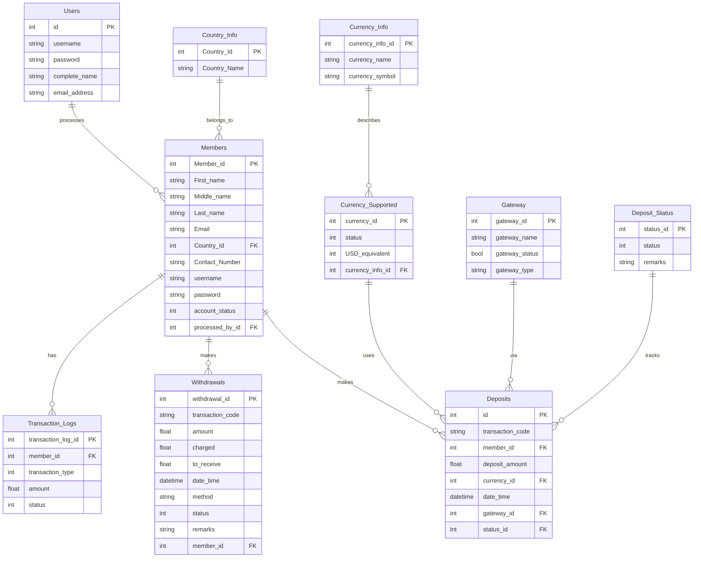

# 💰 Digital Wallet (E-Wallet) — REST API

A full-featured **Digital Wallet** backend built with **FastAPI**, **SQLAlchemy**, and **MySQL**. It exposes RESTful CRUD endpoints for managing users, wallet members, multi-currency support, deposits, withdrawals, payment gateways, and transaction logs.

---

## 🚀 Tech Stack

| Layer | Technology |
|---|---|
| **Framework** | [FastAPI](https://fastapi.tiangolo.com/) |
| **ORM** | [SQLAlchemy](https://www.sqlalchemy.org/) |
| **Database** | MySQL |
| **Validation** | [Pydantic](https://docs.pydantic.dev/) |
| **Language** | Python 3.10+ |

---

## 📁 Project Structure

```
E-wallet-main/
├── main.py        # FastAPI application — all route definitions
├── models.py      # SQLAlchemy ORM models (database tables)
├── schemas.py     # Pydantic request / response schemas
├── crud.py        # Database CRUD helper functions
├── database.py    # Database engine & session configuration
└── README.md
```

---

## 🗄️ Database Schema

The application manages a **MySQL** database called `Digital_Wallet` with the following entities and relationships:



---

## 📡 API Endpoints

All endpoints support JSON request/response bodies. The interactive docs are available at **`/docs`** (Swagger UI) and **`/redoc`** once the server is running.

### 👤 Users
| Method | Endpoint | Description |
|---|---|---|
| `POST` | `/users/` | Create a new admin user |
| `GET` | `/users/` | List all users |
| `GET` | `/users/{user_id}` | Get user by ID |
| `PUT` | `/users/{user_id}` | Update user by ID |
| `DELETE` | `/users/{user_id}` | Delete user by ID |

### 🧑‍💼 Members
| Method | Endpoint | Description |
|---|---|---|
| `POST` | `/members/` | Register a new wallet member |
| `GET` | `/members/` | List all members |
| `GET` | `/members/{member_id}` | Get member by ID |
| `PUT` | `/members/{member_id}` | Update member by ID |
| `DELETE` | `/members/{member_id}` | Delete member by ID |

### 🌍 Country Info
| Method | Endpoint | Description |
|---|---|---|
| `POST` | `/country_info/` | Add a new country |
| `GET` | `/country_info/` | List all countries |
| `GET` | `/country_info/{country_id}` | Get country by ID |
| `PUT` | `/country_info/{country_id}` | Update country by ID |
| `DELETE` | `/country_info/{country_id}` | Delete country by ID |

### 💱 Currency Info
| Method | Endpoint | Description |
|---|---|---|
| `POST` | `/currency_info/` | Add currency metadata |
| `GET` | `/currency_info/` | List all currency info |
| `GET` | `/currecny_info/{currency_info_id}` | Get currency info by ID |
| `PUT` | `/currency_info/{currency_info_id}` | Update currency info |
| `DELETE` | `/currency_info/{currency_info_id}` | Delete currency info |

### 💲 Currency Supported
| Method | Endpoint | Description |
|---|---|---|
| `POST` | `/currency_supported/` | Add a supported currency |
| `GET` | `/currency_supported/` | List all supported currencies |
| `GET` | `/currency_supported/{currency_id}` | Get supported currency by ID |
| `PUT` | `/currency_supported/{currency_id}` | Update supported currency |
| `DELETE` | `/currency_supported/{currency_id}` | Delete supported currency |

### 💵 Deposits
| Method | Endpoint | Description |
|---|---|---|
| `POST` | `/Deposit/` | Create a new deposit |
| `GET` | `/Deposit/` | List all deposits |
| `GET` | `/Deposit/{deposit_id}` | Get deposit by ID |
| `PUT` | `/Deposit/{deposit_id}` | Update deposit by ID |
| `DELETE` | `/Deposit/{deposit_id}` | Delete deposit by ID |

### 🏧 Withdrawals
| Method | Endpoint | Description |
|---|---|---|
| `POST` | `/withdrawals/` | Create a new withdrawal |
| `GET` | `/withdrawals/` | List all withdrawals |
| `GET` | `/withdrawals/{withdrawal_id}` | Get withdrawal by ID |
| `PUT` | `/withdrawals/{withdrawal_id}` | Update withdrawal by ID |
| `DELETE` | `/withdrawals/{withdrawal_id}` | Delete withdrawal by ID |

### 📋 Deposit Status
| Method | Endpoint | Description |
|---|---|---|
| `POST` | `/Deposit_status/` | Add a deposit status |
| `GET` | `/Deposit_status/` | List all deposit statuses |
| `GET` | `/Deposit_status/{status_id}` | Get deposit status by ID |
| `PUT` | `/Deposit_status/{status_id}` | Update deposit status |
| `DELETE` | `/Deposit_status/{status_id}` | Delete deposit status |

### 🏦 Gateway
| Method | Endpoint | Description |
|---|---|---|
| `POST` | `/Gateway/` | Add a payment gateway |
| `GET` | `/Gateway/` | List all gateways |
| `GET` | `/Gateway/{gateway_id}` | Get gateway by ID |
| `PUT` | `/Gateway/{gateway_id}` | Update gateway |
| `DELETE` | `/Gateway/{gateway_id}` | Delete gateway |

### 📊 Transaction Logs
| Method | Endpoint | Description |
|---|---|---|
| `POST` | `/transaction_logs/` | Create a transaction log |
| `GET` | `/transaction_logs/` | List all transaction logs |
| `GET` | `/transaction_logs/{transaction_log_id}` | Get log by ID |
| `PUT` | `/transaction_logs/{transaction_log_id}` | Update log by ID |
| `DELETE` | `/transaction_logs/{transaction_log_id}` | Delete log by ID |

### 📈 Member Transaction Status
| Method | Endpoint | Description |
|---|---|---|
| `GET` | `/members__transaction_status/{member_id}` | Aggregated deposit vs withdrawal summary for a member |

---

## ⚙️ Getting Started

### Prerequisites

- **Python 3.10+**
- **MySQL Server** running locally
- **pip** (Python package manager)

### 1. Clone the Repository

```bash
git clone https://github.com/roshnikri03/E-wallet.git
cd E-wallet/E-wallet-main
```

### 2. Create & Activate a Virtual Environment

```bash
python -m venv venv

# Windows
venv\Scripts\activate

# macOS / Linux
source venv/bin/activate
```

### 3. Install Dependencies

```bash
pip install fastapi uvicorn sqlalchemy pymysql mysql-connector-python pydantic
```

### 4. Configure the Database

1. Open MySQL and create the database:

   ```sql
   CREATE DATABASE Digital_Wallet;
   ```

2. Update the credentials in **`database.py`**:

   ```python
   SQLALCHEMY_DB_URL = "mysql+pymysql://<username>:<password>@localhost/Digital_Wallet"
   ```

3. Also update the `mysql.connector.connect()` block in **`main.py`** with your MySQL username and password.

> **Note:** On first run, SQLAlchemy will auto-create all tables via `Base.metadata.create_all(bind=engine)`.

### 5. Run the Server

```bash
uvicorn main:app --reload
```

The API will be live at **`http://127.0.0.1:8000`**.

### 6. Explore the Docs

- **Swagger UI:** [http://127.0.0.1:8000/docs](http://127.0.0.1:8000/docs)
- **ReDoc:** [http://127.0.0.1:8000/redoc](http://127.0.0.1:8000/redoc)

---

## 🏗️ Architecture Overview

```
Client (Swagger UI / Postman / Frontend)
        │
        ▼
   ┌─────────┐
   │ main.py  │  ← FastAPI route handlers
   └────┬─────┘
        │
   ┌────▼─────┐
   │ schemas  │  ← Pydantic input validation & serialization
   └────┬─────┘
        │
   ┌────▼─────┐
   │  crud    │  ← Reusable DB operations (SQLAlchemy queries)
   └────┬─────┘
        │
   ┌────▼──────┐
   │  models   │  ← ORM table definitions (SQLAlchemy)
   └────┬──────┘
        │
   ┌────▼──────┐
   │ database  │  ← Engine, session, and Base configuration
   └────┬──────┘
        │
        ▼
     MySQL DB
  (Digital_Wallet)
```

**Request flow:** Incoming HTTP request → **`main.py`** (route handler) → validates input with **`schemas.py`** → calls **`crud.py`** for database logic → **`models.py`** maps to DB tables → **`database.py`** manages the connection → **MySQL** stores the data.

---
